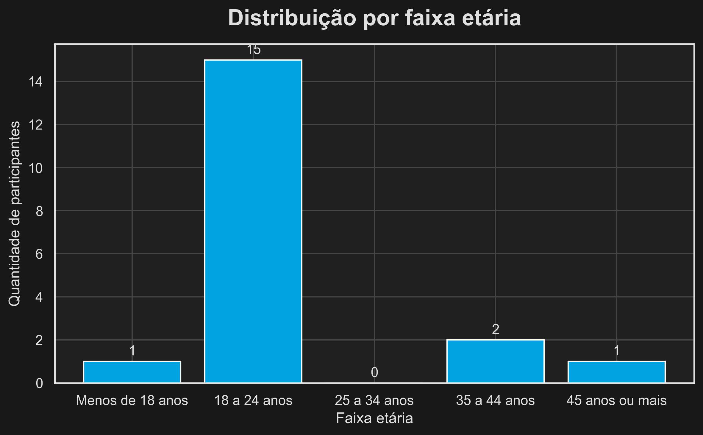
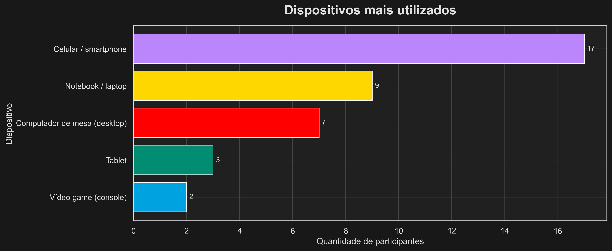
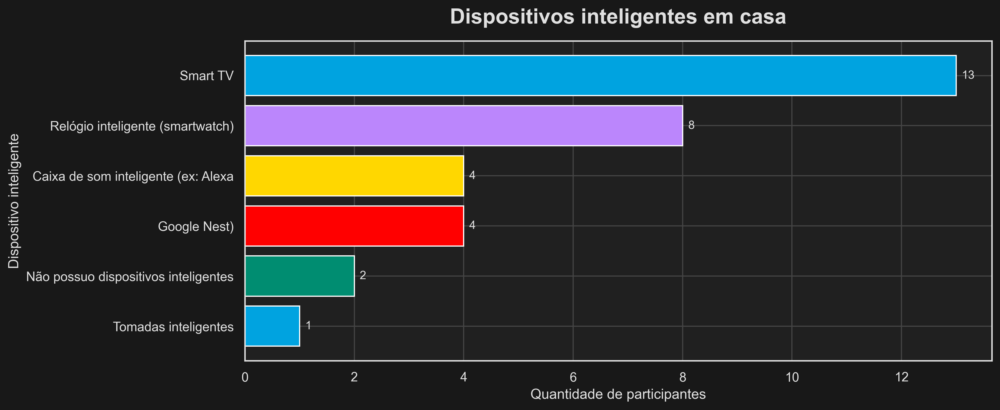
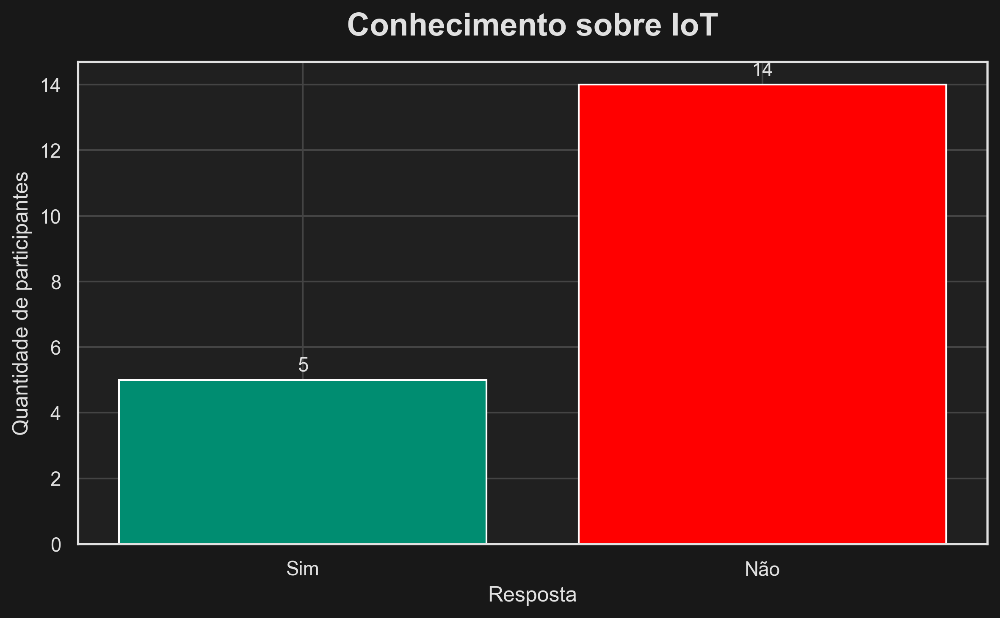
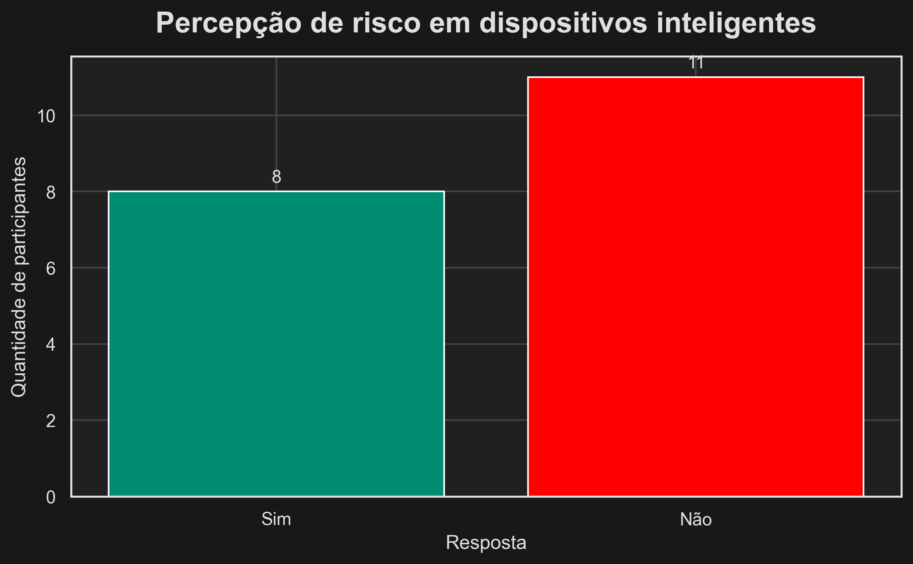
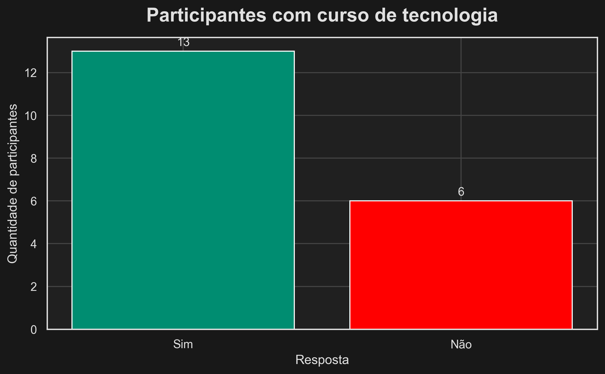

# Análise de Dados sobre Uso de Tecnologia e Dispositivos Inteligentes na Comunidade

Projeto de extensão desenvolvido na disciplina de **Programação de Microcontroladores**, com foco na coleta, tratamento e análise de dados sobre o uso de tecnologia, dispositivos inteligentes e conhecimento sobre IoT em uma comunidade.

A proposta do projeto foi construir um diagnóstico sociotecnológico a partir de dados reais coletados por formulário online, conectando conceitos de microcontroladores, Internet das Coisas (IoT), segurança digital e análise de dados com uma aplicação viável no contexto do ensino a distância.

## Resultados da Pesquisa

Esta seção apresenta os principais resultados obtidos a partir das respostas coletadas no formulário aplicado à comunidade. Os gráficos abaixo foram gerados em Python após as etapas de exploração, limpeza, tratamento e análise dos dados.

### Faixa etária dos participantes



A maior parte dos participantes está concentrada na faixa de **18 a 24 anos**. Também houve poucos respondentes nas faixas “menos de 18 anos”, “35 a 44 anos” e “45 anos ou mais”, enquanto a faixa de 25 a 34 anos não apresentou participantes.

### Dispositivos mais utilizados no dia a dia



O **celular/smartphone** foi o dispositivo mais utilizado pelos participantes. Em seguida, apareceram notebook/laptop e computador de mesa, enquanto tablet e videogame tiveram menor frequência de uso.

### Dispositivos inteligentes presentes em casa



A **Smart TV** foi o dispositivo inteligente mais comum entre os participantes. Também apareceram com destaque smartwatch e caixas de som inteligentes, como Alexa e Google Nest, enquanto poucas pessoas informaram não possuir nenhum dispositivo inteligente em casa.

### Conhecimento sobre IoT



Os resultados mostram que a maioria dos participantes **não conhece o conceito de IoT**. Isso indica que muitas pessoas já convivem com tecnologias conectadas no cotidiano, mas ainda não dominam esse conceito de forma clara.

### Percepção de riscos de segurança



As respostas sobre riscos de segurança em dispositivos inteligentes ficaram divididas entre “Sim” e “Não”. Isso sugere que parte da comunidade reconhece possíveis vulnerabilidades, mas outra parte ainda não percebe esses riscos com clareza.

### Participação em cursos de tecnologia



Mais da metade dos participantes informou já ter realizado algum curso de tecnologia, informática ou programação. Ainda assim, existe uma parcela menor sem esse tipo de formação, o que reforça a importância de ações educativas futuras.

### Interpretação geral dos resultados

De forma geral, os dados revelam que os participantes possuem forte contato com tecnologia no dia a dia, amplo acesso à internet e presença considerável de dispositivos inteligentes em casa. No entanto, o conhecimento sobre IoT ainda é limitado e a percepção sobre segurança digital não é uniforme, o que evidencia a necessidade de ampliar a conscientização sobre o uso seguro e crítico dessas tecnologias.

## Objetivo do Projeto

O objetivo do projeto é investigar como pessoas da comunidade utilizam tecnologia no cotidiano, quais dispositivos inteligentes possuem em casa, se conhecem o conceito de IoT e se percebem riscos de segurança associados a esses dispositivos.

Além disso, o projeto busca transformar os dados coletados em informações organizadas por meio de Python, limpeza de dados e visualizações gráficas, aproximando a disciplina de microcontroladores de uma aplicação social concreta.

## Problema Investigado

Muitas pessoas utilizam dispositivos conectados e inteligentes no dia a dia, mas nem sempre conhecem o conceito de IoT, o papel dos microcontroladores nesses equipamentos ou os riscos relacionados à privacidade e à segurança digital.

Diante disso, o projeto buscou levantar dados reais da comunidade para compreender esse cenário e gerar uma base para futuras ações educativas, como conscientização, materiais explicativos e atividades introdutórias sobre tecnologia conectada.

## Metodologia

A pesquisa foi realizada por meio de um formulário online criado no Google Forms e aplicado a participantes da comunidade por meios digitais, como redes sociais e contatos pessoais.

Após a coleta, os dados foram exportados em formato CSV e organizados em três etapas principais:

1. **Exploração inicial dos dados**: leitura do arquivo bruto e entendimento da estrutura do conjunto de dados.
2. **Limpeza e tratamento**: padronização dos nomes das colunas e preparação da base final para análise.
3. **Análise dos resultados**: geração de indicadores e gráficos para interpretar o perfil dos participantes e seu comportamento tecnológico.

## Estrutura do Projeto

```text
.
├── data/
│   ├── raw/
│   │   └── respostas_google_forms.csv
│   └── processed/
│       └── respostas_tratadas.csv
├── docs/
├── evidences/
├── notebooks/
│   ├── 01_exploracao_inicial.ipynb
│   ├── 02_limpeza_tratamento.ipynb
│   └── 03_analise_resultados.ipynb
├── outputs/
│   ├── conhece_iot.png
│   ├── curso_tecnologia.png
│   ├── disp_inteligentes_casa.png
│   ├── dispositivos_uso.png
│   ├── faixa_etaria.png
│   └── risco_seguranca_disp.png
├── src/
│   ├── analyze_data.py
│   ├── clean_data.py
│   ├── config.py
│   ├── load_data.py
│   ├── main.py
│   └── visualize_data.py
└── README.md
```

## Etapas dos Notebooks

### 1. Exploração inicial

No notebook `01_exploracao_inicial.ipynb`, foi realizada a leitura do arquivo bruto gerado pelo Google Forms, com inspeção inicial das colunas, respostas e estrutura geral dos dados.

### 2. Limpeza e tratamento

No notebook `02_limpeza_tratamento.ipynb`, as colunas do formulário foram renomeadas para nomes mais curtos e adequados ao uso em Python, gerando um arquivo tratado para as análises seguintes.

### 3. Análise dos resultados

No notebook `03_analise_resultados.ipynb`, foram criados gráficos e indicadores para responder às perguntas centrais do projeto, como faixa etária predominante, uso de dispositivos, presença de dispositivos inteligentes, conhecimento sobre IoT, percepção de risco e participação em cursos de tecnologia.

## Organização do Código

A pasta `src/` reúne os módulos responsáveis por transformar o fluxo desenvolvido nos notebooks em um pipeline mais organizado e reutilizável.

- `config.py`: define os caminhos principais do projeto.
- `load_data.py`: faz a leitura dos arquivos CSV.
- `clean_data.py`: renomeia colunas e salva a base tratada.
- `analyze_data.py`: contém funções de contagem e geração de indicadores.
- `visualize_data.py`: configura o tema visual e gera os gráficos.
- `main.py`: executa o fluxo principal de limpeza, análise e exportação dos resultados.

## Tecnologias Utilizadas

- Python
- Pandas
- Matplotlib
- Seaborn
- Jupyter Notebook
- Google Forms
- CSV
- Git e GitHub

## Como Executar o Projeto

### 1. Clonar o repositório

```bash
git clone https://github.com/Igor-Barross/projeto-extensao-microcontroladores.git
cd projeto-extensao-microcontroladores
```

### 2. Criar e ativar o ambiente virtual

```bash
python -m venv venv
```

No Windows:

```bash
venv\Scripts\activate
```

No Linux/macOS:

```bash
source venv/bin/activate
```

### 3. Instalar as dependências

```bash
pip install pandas matplotlib seaborn jupyter
```

### 4. Executar o pipeline principal

```bash
python src/main.py
```

### 5. Abrir os notebooks

```bash
jupyter notebook
```

## Repositório no GitHub

O projeto foi documentado e disponibilizado em um repositório público no GitHub, reunindo os notebooks, módulos em Python, arquivos processados, gráficos gerados e demais evidências da atividade de extensão.

Acesse o repositório em:

[https://github.com/Igor-Barross/projeto-extensao-microcontroladores](https://github.com/Igor-Barross/projeto-extensao-microcontroladores)

## Evidências da Atividade de Extensão

As evidências do projeto incluem:

- print da divulgação do formulário em rede social;
- print da quantidade de respostas coletadas no Google Forms;
- gráficos gerados a partir da análise dos dados;
- relatório final em PDF;
- organização do repositório no GitHub com o código-fonte do projeto.

## Possíveis Desdobramentos

Os resultados deste projeto podem servir de base para ações futuras de extensão, como:

- produção de material educativo sobre IoT;
- explicações introdutórias sobre microcontroladores;
- conscientização sobre segurança digital;
- novas coletas com públicos maiores ou mais específicos;
- oficinas ou conteúdos de apoio voltados à comunidade.

## Autor

Projeto desenvolvido por estudante de Ciência da Computação no contexto da disciplina **Programação de Microcontroladores (EAD)**.
